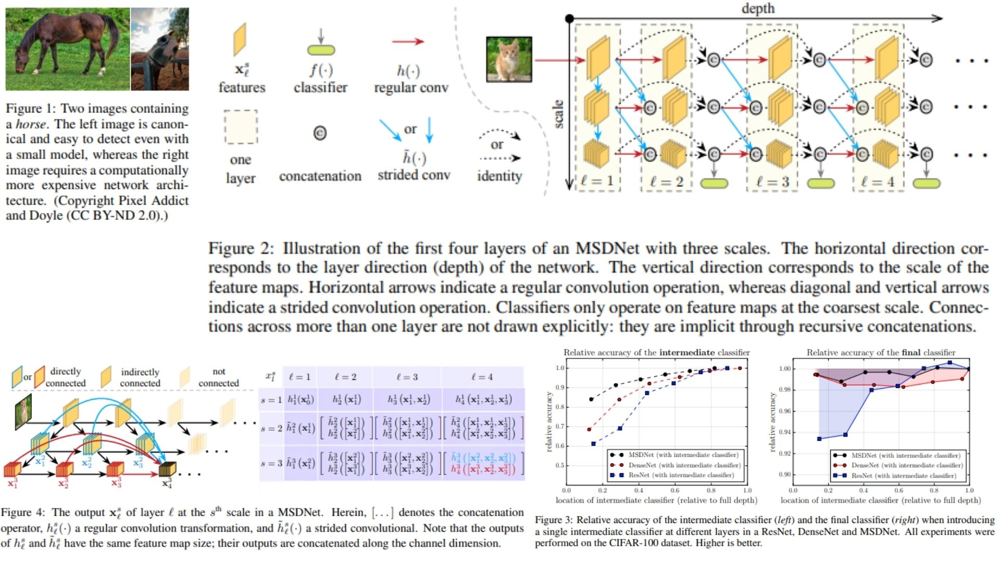

# 🌌 MSDNet Replication – Sample-Level Early Exits for Resource-Efficient Classification

This repository provides a **PyTorch-based replication** of  
**Multi-Scale Dense Networks (MSDNet) – Resource-Efficient Image Classification**.

The focus is **understanding MSDNet sample-level early exit**,  
rather than fully training models or maximizing benchmark accuracy.

- Multi-scale CNN backbone with **dense connections** 🔗  
- **Sample-level early exits** 🏹 for adaptive computation  
- Confidence-based exit thresholds for **computation reduction** ⚡  
- Demonstrates theoretical **efficiency vs accuracy trade-off** 🌿  

**Paper reference:** [MSDNet: Multi-Scale Dense Networks](https://arxiv.org/abs/1703.09844) 🔎

---

## ⛺️ Overview – MSDNet Architecture



### 🌱 High-level Pipeline

1. **Input image**

```math
X \in \mathbb{R}^{B \times 3 \times H \times W} 
```

2. **Initial convolution per scale**

```math
F^{(0)}_s = Conv(X), \quad s=1..S 
```

3. **Multi-scale dense blocks**

```math
F^{(l)}_s = MultiScaleBlock(F^{(l-1)}_1, ..., F^{(l-1)}_S), \quad l=1..L 
```

4. **Sample-level early exit classifier**

```math
\hat{Y}_b = 
\begin{cases} 
FC(F^{(l)}_S) & \text{if } \max(\text{softmax}(FC(F^{(l)}_S))) \ge \tau_l \\
\text{next layer} & \text{otherwise}
\end{cases} 
```

> $$\tau_l$$ is the confidence threshold for layer $$l$$, ensuring each sample exits adaptively.

---

## 🌿 What the Model Demonstrates

- **Multi-scale blocks**: extract features at different resolutions 🌸  
- **Dense connectivity**: reuse features across layers 🔗  
- **Sample-level early exit**: each input may exit at different layers 🏹  
- **Adaptive computation**: reduce FLOPs for easy examples ⚡  
- **Forward-only**: theoretical replication; no training conducted 🧪  

---

## 📦 Repository Structure

```bash
MSDNet-Replication/
├── src/
│   ├── layers/
│   │   ├── conv_block.py          
│   │   ├── activation.py          
│   │   ├── normalization.py      
│   │   └── pooling.py             
│   │
│   ├── backbone/
│   │   └── multi_scale_blocks.py 
│   │
│   ├── model/
│   │   └── msdnet.py         
│   │
│   ├── classifiers/
│   │   └── early_exit.py          
│   │
│   ├── utils/
│   │   └── cost_estimation.py     
│   │
│   ├── loss/
│   │   └── msdnet_loss.py       
│   │
│   └── config.py                 
│
├── images/
│   └── figmix.jpg
│
├── requirements.txt
└── README.md
```

---

## 🔗 Feedback

For questions or feedback, contact: [barkin.adiguzel@gmail.com](mailto:barkin.adiguzel@gmail.com)
